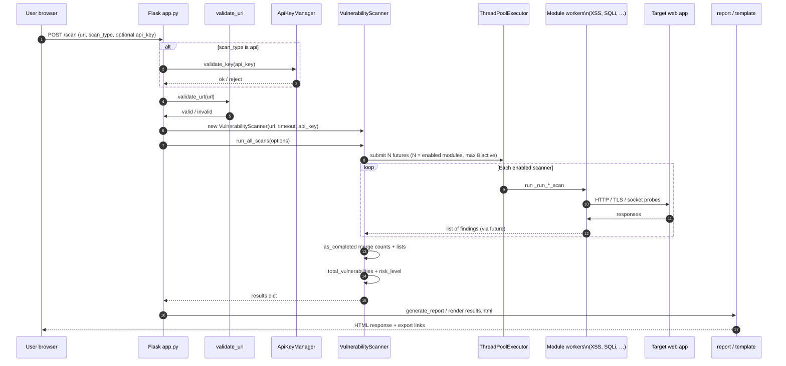

# CyberWolfScanner — Working Principles, Flowcharts, and References

This document explains **how CyberWolfScanner works** end-to-end: user interaction, scan orchestration, modular checks, aggregation, reporting, and error handling. It complements the diagrams under `Document/assets/flowcharts/` (SVG) and `Document/07_System_Architecture.md` / `Document/10_Dataflow_Workflow_Tables.md`.

**How to view large diagrams:** Mermaid charts below are intentionally wide and layered. If your preview truncates them, open the file in [Mermaid Live Editor](https://mermaid.live) or export from GitHub/GitLab Markdown preview at full width.

---

## 1. Large-scale system architecture (layered)

This diagram shows **every major responsibility area**: who the user talks to, what validates input, what runs in parallel, what produces artifacts, and where optional AI fits. Arrows are read as “data or control flows to.”

```mermaid
flowchart TB
    subgraph CLIENT["Client / operator"]
        U[("User / security analyst")]
    end

    subgraph PRES["Presentation layer — two UIs"]
        F["Flask web app\n`app.py` + `templates/`\nforms, REST-style hooks, sessions"]
        ST["Streamlit dashboard\n`wolf.py`\ncharts, multi-step workflows"]
    end

    subgraph CROSS["Cross-cutting input control"]
        V["URL & target validation\n`utils/validator.py`\nreject malformed URLs early"]
        AKM["API key lifecycle (Flask path)\n`ApiKeyManager` + `api_keys.json`\ngenerate / validate / revoke"]
    end

    subgraph ORCH["Orchestration — single coordinator"]
        VS["`VulnerabilityScanner`\n`modules/scanner.py`\nconstructs all scanner objects,\nmerges `results` + `summary`"]
    end

    subgraph MODS["Scanning layer — modular DAST-style probes"]
        direction TB
        M_WEB["Web attack surface\nXSS · SQLi · paths · misconfig · CSRF · IDOR"]
        M_PROTO["Protocol & transport\nSSL/TLS · ports · API surface"]
        M_ADV["Advanced patterns\nXXE · SSRF · RCE · JWT · bruteforce heuristics"]
    end

    subgraph AUX["Auxiliary analysis (optional paths)"]
        WS["`web_scraper.py`\ncrawl / extract context"]
        NS["`modules/network_scanner.py` / `subdomain_finder.py`\nDNS & network context"]
        AI["`wolf_api.py` · `security_analyzer.py`\nLLM / API-assisted narration"]
    end

    subgraph OUT["Outputs"]
        RG["`report_generator.py`\n`utils/reporter.py`\nHTML / structured report"]
        UI_OUT["Rendered UI\n`results.html` or Streamlit components"]
    end

    U --> F
    U --> ST
    F --> V
    ST --> V
    F --> AKM
    AKM -.->|"if API scan mode"| VS
    V -->|"valid URL, timeout, api_key"| VS
    ST --> VS

    VS --> M_WEB
    VS --> M_PROTO
    VS --> M_ADV

    ST -.-> WS
    ST -.-> NS
    ST -.-> AI

    VS --> RG
    RG --> UI_OUT
    F --> UI_OUT
    ST --> UI_OUT
```

### Deep explanation (architecture)

1. **Dual UI is intentional.** Flask gives a traditional multi-page scan/report experience; Streamlit favors rapid dashboards and richer widgets. Both must agree on the same contract toward the backend: a **normalized URL**, optional **module flags**, and a **timeout**.

2. **Validation before orchestration** avoids SSRF-style misuse and reduces noise: the scanner constructor calls `validate_url`; failure raises before any `ThreadPoolExecutor` work starts.

3. **Modular scanners** are not one giant script. Each file under `modules/*_scanner.py` owns one OWASP-aligned or infrastructure-aligned concern. That mirrors how professional DAST tools separate **rule packs**.

4. **Optional AI and crawling** do not replace the scanners; they **annotate** or **expand context** (e.g., explaining findings for non-experts). When the API is down, UIs can fall back to deterministic output.

---

## 2. End-to-end operational lifecycle (from click to risk label)

Walk-through of what happens **from a single user decision** (“scan this URL”) to a **published risk level** and report.

```mermaid
flowchart TD
    START([User submits target URL]) --> CHOOSE{Which surface?}

    CHOOSE -->|Flask `POST /scan`| F1[Read `url`, `scan_type`, optional `api_key`]
    CHOOSE -->|Streamlit action| S1[Read widget state:\nURL, toggles, timeouts]

    F1 --> FAPI{`scan_type == api`?}
    FAPI -->|yes| VALKEY[Validate key via `ApiKeyManager`]
    FAPI -->|no| BUILD
    VALKEY -->|invalid| ERR1[Flash error / stop]
    VALKEY -->|valid| BUILD[Build `options` dict:\nwhich modules run]

    S1 --> BUILD

    BUILD --> VALURL[`validate_url(url)`]
    VALURL -->|fail| ERR2[Show error:\ninvalid URL format]
    VALURL -->|pass| CONS["`VulnerabilityScanner(url, timeout, api_key)`\nallocate 13 scanner instances"]

    CONS --> RUN["`run_all_scans(options)`"]
    RUN --> POOL["`ThreadPoolExecutor(max_workers=8)`\nsubmit one future per enabled module"]

    POOL --> WAIT["`as_completed(futures)`\nstream results as threads finish"]
    WAIT --> EACH{Per future:\n`future.result(timeout)`}

    EACH -->|success| STORE["`results[module] = list of findings`\n`summary[module] = count`"]
    EACH -->|exception| SAFE["Log error\n`results[module] = []`\n`summary[module] = 0`"]

    STORE --> MORE{More futures?}
    SAFE --> MORE
    MORE -->|yes| WAIT
    MORE -->|no| TOT["`total_vulnerabilities` = sum of summary counts"]

    TOT --> RISK{"Threshold rules\n(see `scanner.py`)"}
    RISK -->|total == 0| RL0["`MINIMAL`"]
    RISK -->|1–2| RL1["`LOW`"]
    RISK -->|3–5| RL2["`MEDIUM`"]
    RISK -->|6–10| RL3["`HIGH`"]
    RISK -->|greater than 10| RL4["`CRITICAL`"]

    RL0 & RL1 & RL2 & RL3 & RL4 --> PACK["Attach `risk_level` + `total_vulnerabilities`\nto `results['summary']`"]
    PACK --> REP["Flask: `generate_report` / render template\nStreamlit: dataframe + charts"]
    REP --> END([User reviews / exports])

    RUN -.->|KeyboardInterrupt| KI[Return partial `results`]
    KI --> END
```

### Deep explanation (lifecycle)

1. **`options` is the feature switch.** If `options` is omitted, `run_all_scans` enables every module (XSS through SSL). Partial scans are just a sparse `options` map.

2. **Concurrency is bounded at 8 workers**, so sixteen modules do not spawn sixteen unbounded blocking calls; the pool amortizes socket and DNS latency.

3. **Per-module isolation:** a thrown exception in SQLi does not wipe XSS results—the coordinator catches, logs, and stores an empty list for that module only.

4. **Risk is a count-based heuristic**, not CVSS. It is fast to explain to stakeholders but should be documented as **qualitative**, not a substitute for penetration-test severity.

### Alternate view: detailed sequence (Flask path)

Parallel module work appears as repeated `Scanner->>Target` interactions; the coordinator aggregates after all futures settle.



---

## 3. Inside `run_all_scans`: futures, summaries, and interrupts

This is the **most code-faithful** view of `modules/scanner.py`: which tasks are submitted, how completion is processed, and where totals are derived.

```mermaid
flowchart TB
    subgraph ENTER["Entry: `run_all_scans(options)`"]
        O{"`options is None`?"}
        O -->|yes| DEF["Default: all module keys = True\nxss, sqli, ports, paths, misconfig,\nxxe, ssrf, rce, idor, csrf, jwt,\napi, bruteforce, ssl"]
        O -->|no| USE["Use caller-provided flags"]
        DEF --> TP
        USE --> TP
    end

    subgraph POOL["`with ThreadPoolExecutor(max_workers=8)`"]
        direction LR
        SUB["For each enabled key:\n`executor.submit(self._run_*_scan)`"]
        MAP["Maintain `scan_tasks`:\nfuture → module name string"]
    end

    TP[Begin thread pool] --> SUB
    SUB --> MAP

    subgraph COMP["Completion loop: `as_completed(scan_tasks)`"]
        FUT[Take next completed future]
        NAME[Resolve module label from `scan_tasks` map]
        FUT --> NAME
        NAME --> TRY{"`future.result(timeout=self.timeout)`"}
        TRY -->|OK| OK["`results[name] = list`\n`summary[name] = len(list)`"]
        TRY -->|except| BAD["`results[name] = []`\n`summary[name] = 0`\nlog `Error in {name} scan`"]
        OK --> NEXT
        BAD --> NEXT{More futures?}
        NEXT -->|yes| FUT
        NEXT -->|no| DONE[Exit loop]
    end

    MAP --> COMP

    subgraph GUARD["Outer exception handling"]
        KB["`KeyboardInterrupt` →\nmessage + return `results`"]
        OUTER["Other errors →\nmessage + return `results`"]
    end

    DONE --> SUMS
    SUMS["Sum all numeric values in `summary`\n→ `total_vulnerabilities`"]

    SUMS --> RISK["Assign `risk_level`:\n>10 CRITICAL\n>5 HIGH\n>2 MEDIUM\n>0 LOW\nelse MINIMAL"]

    RISK --> RET["Return `self.results`"]

    ENTER -.-> GUARD
```

### Deep explanation (orchestration)

1. **Submit pattern:** each `_run_*` wrapper prints status, then delegates to `some_scanner.scan(self.url, self.api_key)`. That keeps HTTP/session logic inside the specialist class.

2. **`as_completed`:** results are merged **as they finish**, which is why the UI can show streaming logs (terminal) or progressively filled structures if wired that way.

3. **`future.result(timeout=self.timeout)`** ties thread wait to the same SLA as HTTP calls, reducing hangs.

4. **Interrupt safety:** operators stopping a long scan get a **partial snapshot** rather than a silent crash.

---

## 4. Generic “single scanner module” deep flow

Every `*_scanner.py` follows the same **logical pipeline**, even if internals differ.

```mermaid
flowchart LR
    subgraph INP["Inputs"]
        URL2["Normalized URL"]
        KEY["Optional `api_key`"]
        TO["`timeout` from coordinator"]
    end

    subgraph PHASES["Typical module phases"]
        P1["1. Prepare request:\nheaders, cookies, method"]
        P2["2. Emit probes:\npaths, params, payloads, OPTIONS"]
        P3["3. Observe responses:\nstatus, body snippets, headers"]
        P4["4. Classify signals:\npatterns, diffs, timing"]
        P5["5. Emit findings:\nlist of dicts\nseverity, evidence, URL"]
    end

    subgraph OUTM["Module output"]
        L["Python `list`\nempty = no issues\nnon-empty = potential findings"]
    end

    URL2 --> P1
    KEY -.-> P1
    TO -.-> P2
    P1 --> P2 --> P3 --> P4 --> P5 --> L
```

### Deep explanation (module logic)

1. **Probes are heuristics**, not proofs. A “possible SQLi” banner is an indicator for humans or for a follow-on manual test.

2. **List-shaped results** keep the coordinator simple: it only needs `len(result)` for counting.

3. **Timeouts** propagate so one slow port scan does not redefine the timeout for XSS unless you configure it that way at construction.

---

## 5. Data model: `results` and `summary` structure

How data is shaped **after** a successful pass through the coordinator (before templates).

```mermaid
flowchart TB
    subgraph DICT["`self.results` — top-level dict"]
        KXSS["`xss`: list"]
        KSQL["`sqli`: list"]
        KPORT["`ports`: list"]
        KPATH["`paths`: list"]
        KMIS["`misconfig`: list"]
        KXXE["`xxe`: list"]
        KSSRF["`ssrf`: list"]
        KRCE["`rce`: list"]
        KIDOR["`idor`: list"]
        KCSRF["`csrf`: list"]
        KJWT["`jwt`: list"]
        KAPI["`api`: list"]
        KBF["`bruteforce`: list"]
        KSSL["`ssl`: list"]
        KSUM["`summary`: nested dict"]
    end

    subgraph SUMK["`summary` keys (after run)"]
        S1["per-module counts:\n`xss`, `sqli`, … → int"]
        STOT["`total_vulnerabilities`: int"]
        SRISK["`risk_level`: str\nMINIMAL…CRITICAL"]
    end

    KSUM --> S1
    S1 --> STOT
    STOT --> SRISK

    DICT --> RPTIN["Consumed by\n`report_generator` / Jinja / Streamlit"]
```

### Deep explanation (data flow)

1. **The UI never needs to know 13 class names**—it iterates keys in `results` excluding `summary`.

2. **`summary` doubles as metrics:** quick charts use counts; drill-down views use the lists.

3. **Optional AI** consumes the same structure: serialize lists to text for a model, or summarize top findings only.

---

## 6. Error, resilience, and security-relevant control flow

```mermaid
flowchart TD
    subgraph INITERR["Constructor / setup"]
        BADURL["`validate_url` fails"] --> NOCTOR["`ValueError`\nscanner object not created"]
    end

    subgraph RUNERR["During `run_all_scans`"]
        SINGLE["Single module raises"] --> CATCH["Caught at future boundary\nempty result for that module"]
        TIMEOUT["`future.result` timeout"] --> CATCH
        NET["HTTP errors in scanner"] --> CATCH2["Usually caught inside module\n→ short or empty list"]
        KB2["User Ctrl+C"] --> KRET["Interrupt handler\nreturn partial results"]
    end

    subgraph POST["After merge"]
        AGGOK["All modules finished or cleared"] --> LABEL["Compute `risk_level`"]
    end

    CATCH --> AGGOK
    CATCH2 -.-> AGGOK
    KRET -.->|"skip label if returned early"| UIEND
    LABEL --> UIEND([UI / report render])
```

### Deep explanation (resilience)

1. **Fail-fast on bad URLs** protects operator time and avoids ambiguous “scans” against junk targets.

2. **Per-module catch** implements **degraded completeness**: you still receive SSL and port data even if RCE heuristics crashed.

3. **Do not confuse resilience with safety:** the tool can still generate **network traffic**; run it only on systems you are authorized to test.

---

## 7. Functional workflow table

| Step | Actor | Input | Processing | Output |
|------|-------|--------|------------|--------|
| 1 | User | Target URL, scan mode | Chooses web UI (Flask or Streamlit) | Scan request |
| 2 | System | URL | `validate_url` | Proceed or reject |
| 3 | System | URL, timeout, options | Construct `VulnerabilityScanner` | Ready orchestrator |
| 4 | System | Target | Parallel module execution | Per-module finding lists |
| 5 | System | Raw findings | Count + classify risk | `summary` |
| 6 | System | Results | `generate_report` / templates | HTML / downloadable report |
| 7 | User | Report | Review dashboard | Remediation planning |

---

## 8. Module-to-purpose mapping (scan layer)

| Module key | Purpose (short) |
|------------|-----------------|
| `xss` | Reflected/stored XSS heuristics |
| `sqli` | SQL injection probes / indicators |
| `ports` | Exposed services / port checks |
| `paths` | Sensitive path discovery |
| `misconfig` | Common header/config issues |
| `xxe` | XML external entity exposure patterns |
| `ssrf` | Server-side request misuse indicators |
| `rce` | Remote execution pattern signals |
| `idor` | Object reference access issues |
| `csrf` | CSRF protection signals |
| `jwt` | JWT structure / weak claims checks |
| `api` | REST/GraphQL-style API issues |
| `bruteforce` | Weak auth / rate-limit heuristics |
| `ssl` | TLS/SSL configuration review |

---

## 9. IEEE-style reference papers (table)

The following table lists **ten** references in **IEEE citation style** (numbered). Use `[1]`–`[10]` in your paper’s reference list. Verify page numbers and spelling against IEEE Xplore or the publisher site for final camera-ready copy.

| Ref. | IEEE-formatted bibliography |
|------|------------------------------|
| [1] | J. Bau, E. Bursztein, D. Gupta, and J. C. Mitchell, “State of the Art: Automated Black-Box Web Application Vulnerability Testing,” in *Proc. IEEE Symp. Security Privacy*, Oakland, CA, USA, 2010, pp. 332–346. |
| [2] | A. Doupé, M. Cova, and G. Vigna, “Why Johnny Can't Pentest: An Analysis of Black-Box Web Vulnerability Scanners,” in *Proc. 7th Int. Conf. Detection Intrusions Malware Vulnerability Assessment (DIMVA)*, Bonn, Germany, 2010, pp. 111–131, doi: 10.1007/978-3-642-14215-4\_7. |
| [3] | NIST, *Technical Guide to Information Security Testing and Assessment*, Special Publication 800-115, Aug. 2008. |
| [4] | MITRE, “2023 CWE Top 25 Most Dangerous Software Weaknesses,” MITRE Corp., 2023. [Online]. Available: https://cwe.mitre.org/top25/ |
| [5] | OWASP Foundation, “OWASP Top 10:2021 — The Ten Most Critical Web Application Security Risks,” OWASP, 2021. [Online]. Available: https://owasp.org/www-project-top-ten/ |
| [6] | D. Balzarotti et al., “Saner: Composing Static and Dynamic Analysis to Validate Sanitization in Web Applications,” in *Proc. IEEE Symp. Security Privacy*, Oakland, CA, USA, 2008, pp. 387–401. |
| [7] | J. C. Fonseca, M. Vieira, and H. Madeira, “Evaluation of Web Security Mechanisms Using Vulnerability & Attack Injection,” *IEEE Trans. Dependable Secure Comput.*, vol. 11, no. 5, pp. 453–468, Sep./Oct. 2014, doi: 10.1109/TDSC.2013.56. |
| [8] | S. Alazmi and D. Conte de León, “A Systematic Literature Review on the Characteristics and Effectiveness of Web Application Vulnerability Scanners,” *IEEE Access*, vol. 10, pp. 33200–33219, 2022, doi: 10.1109/ACCESS.2022.3161522. |
| [9] | S. B. Lipner, “Principles for Secure Software Development,” *IEEE Security Privacy*, vol. 9, no. 2, pp. 71–75, Mar./Apr. 2011, doi: 10.1109/MSP.2011.46. |
| [10] | J. V. Antunes, N. Neves, and P. Veríssimo, “Detection and Prediction of Resource Exhaustion Attacks,” in *Proc. IEEE/IFIP Int. Conf. Dependable Syst. Netw. (DSN)*, 2008, pp. 102–111, doi: 10.1109/DSN.2008.4630062. |

**Notes for authors**

- Entries **[1]**, **[6]**, **[7]**, **[8]**, **[9]**, and **[10]** are **IEEE** journals, magazines, or IEEE/co-sponsored conference proceedings (suitable for an IEEE-style reference list).
- **[2]** is a **highly cited** black-box scanner evaluation in **Springer LNCS** (DIMVA); commonly cited next to IEEE DAST work—confirm house style if your venue requires *only* IEEE publications.
- **[3]**, **[4]**, and **[5]** are **standards and industry bodies** (NIST, MITRE CWE, OWASP) frequently paired with IEEE sources in applied security papers.

Double-check vol./no./pages in IEEE Xplore before camera-ready submission; use the DOI links when available.

---

## 10. Link to repository artifacts

| Artifact | Path |
|---------|------|
| Architecture write-up | `Document/07_System_Architecture.md` |
| Workflow tables & Mermaid | `Document/10_Dataflow_Workflow_Tables.md` |
| SVG flowcharts | `Document/assets/flowcharts/*.svg` |
| Scan coordinator | `modules/scanner.py` |
| Flask integration | `app.py` |

---

*Document generated for CyberWolfScanner — working description, flowcharts, and bibliography table for academic referencing.*
